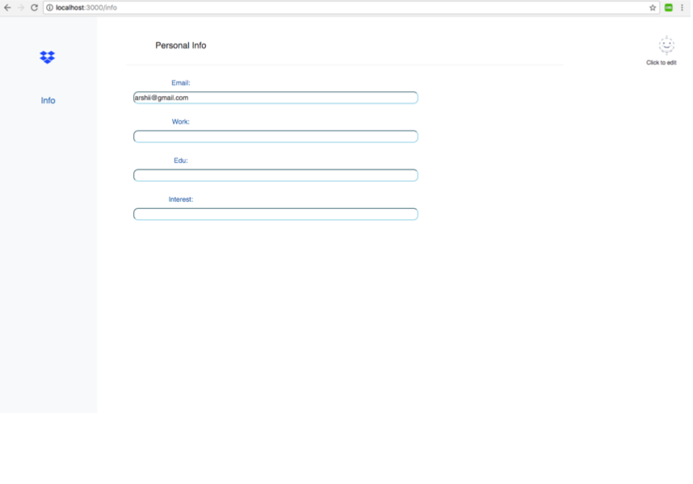

# Dropbox_Prototype

Dropbox Prototype using technologies:

• Frontend: ReactJs  
• Backend:  node.js, SpringBoot  
• Database: MySQL, MongoDB 
• Messaging Queue: Kafka 

Features: 

• Login  
• Register 
• List files and directories 
• Upload files and create directories 
• Share files or directories 
• Delete files or directories 
• Star files or directories 
• Update personal info 
• See files shared with the user 
• See activity logs

Steps to run the application:

Back-end server
	
1. cd DropboxReact_Server
2. npm install
3. npm start

Front-end server

1. cd dropboxreact_UI
2. npm install
3. npm start
	
Kafka 

1. Run the script topics.sh
2. cd kafka
3. npm install
4. npm start
	
SpringBoot

1. Open in IntelliJ and click on play button on the top

Below are some screenshots demonstrating the application:

### Login Page

### Register Page

### Welcome Page

### Upload file

### Create directory

### List files/directories

### Star file/directory

### Remove file/directory

### See Personal Info

### Edit Personal Info

### Share file/directory

### List shared files

### See activity logs

